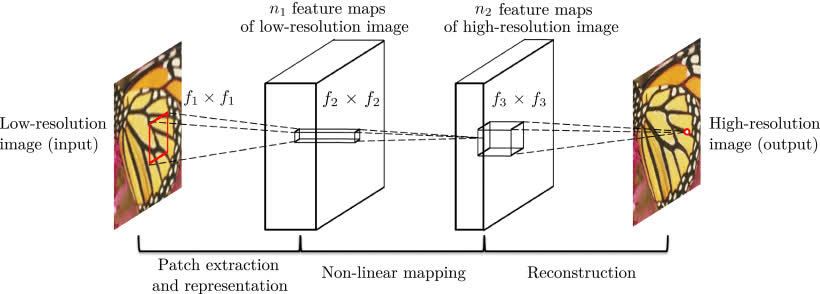

# SRCNN Implementation 

This repository provides a comprehensive implementation of the paper **[Image Super-Resolution Using Deep Convolutional Networks](https://arxiv.org/pdf/1501.00092)**, authored by **Chao Dong**, **Chen Change Loy**, **Kaiming He**, and **Xiaoou Tang**. The paper introduces the concept of using deep learning-based Convolutional Neural Networks (CNNs) to enhance the resolution of low-resolution images efficiently.

This repository implements the SRCNN architecture using PyTorch and provides a clear and beginner-friendly introduction to deep learning and convolutional neural networks (CNNs)!

## 🔜 Project Status

This project is currently ongoing. Suggestions, and feedback are welcome. Stay tuned for more updates!

---

## 🛠️ How Does SRCNN Work?

SRCNN is a simple but effective model consisting of three main layers:
1. **Patch Extraction Layer**: 
- Extract patches from a low resolution images based on the size of filters
- The filter then extracts an n1-dimensional feature for each patch
- The more filters a layer has, the more features it can capture, meaning the upscaled images are of higher quality
- Each filter has a certain size, larger filters can capture more image details

2. **Non-Linear Mapping Layer**: 
- This layer maps each of these n1-dimensional vectors into an n2-dimensional feature
- This mapping helps capture more complex patterns in the image by applying a non-linear mapping
- The non linear mapping is not on a patch of input image, but on a patch of the feature map
- This means the filter goes through each patch of the feature map (n1-dimensional)

3. **Reconstruction**: 
- aggregate the high-resolution patch-wise representations to generate final high resolution image

---

## 📂 Repository Structure (Will be updated soon!)
